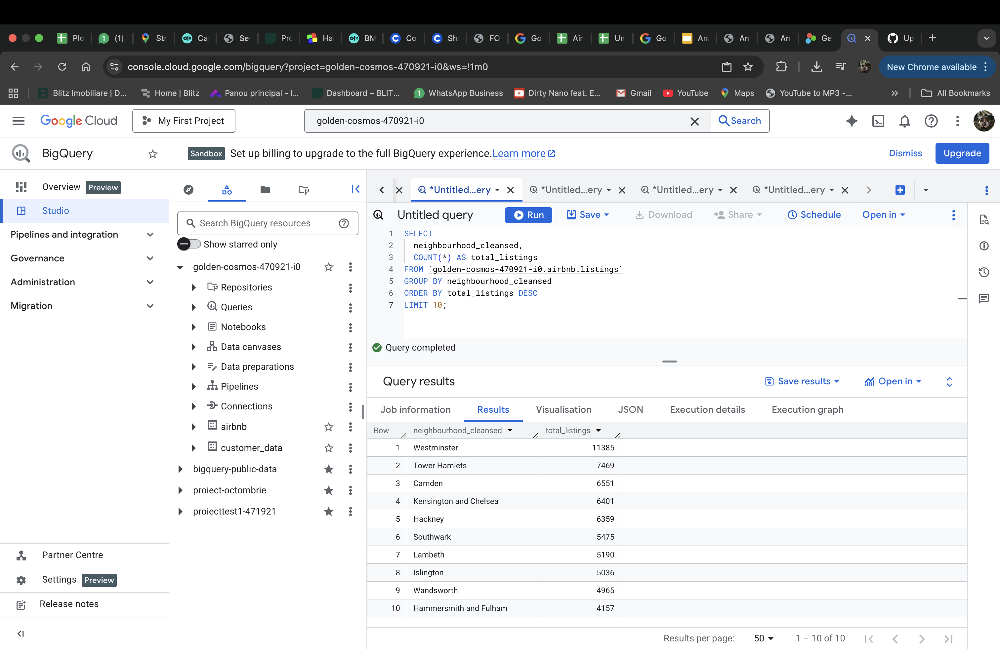
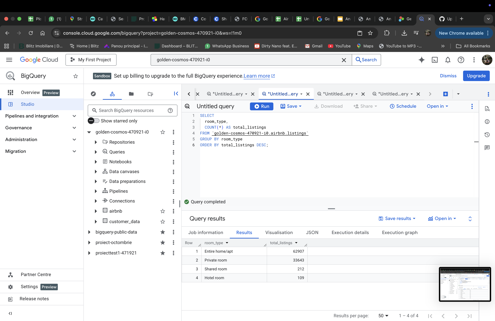
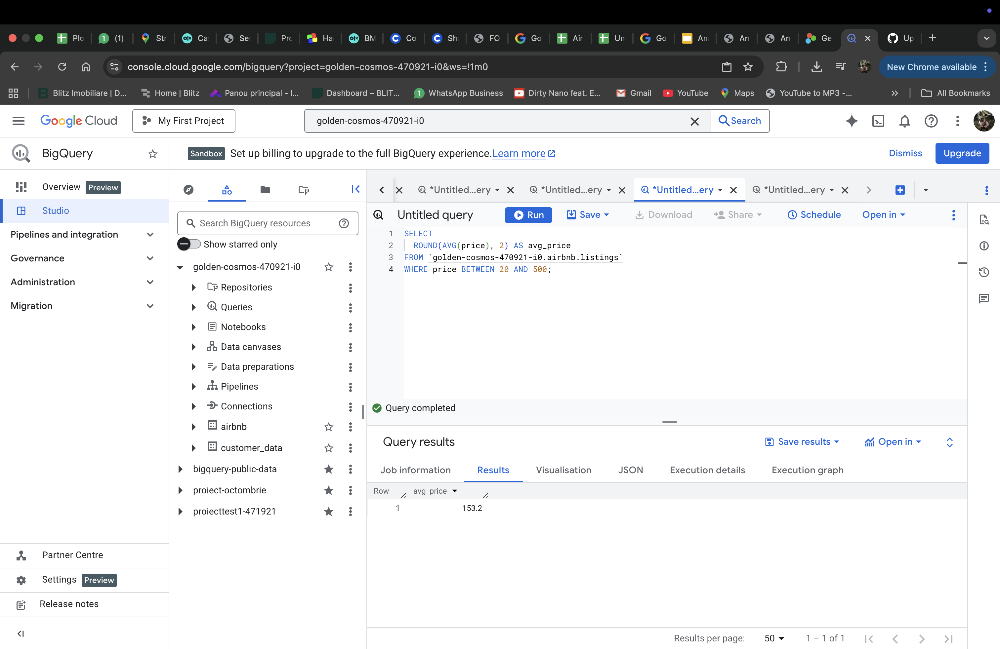
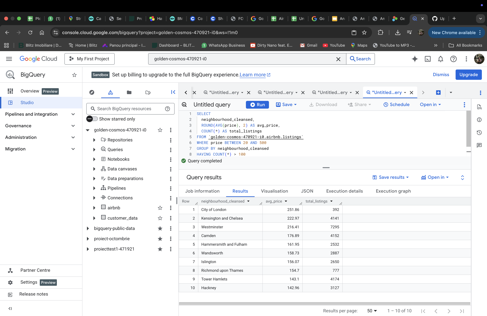

# Airbnb London Investment Analysis

## 📌 Project Overview
This case study analyzes Airbnb listings in London to identify high-potential areas for short-term rental investment.  
The analysis focuses on pricing, availability, and neighborhood performance using SQL queries executed in Google BigQuery.

---

## 🎯 Business Question
Which areas in London offer the best balance between:
- High average nightly prices
- Strong demand (availability patterns)
- Investment attractiveness for Airbnb hosts?

---

## 🗂️ Dataset
- Source: Public Airbnb listings dataset
- Location: London
- Tool used for querying: Google BigQuery
- Timeframe: Latest available snapshot

---

## 🛠️ Tools Used
- SQL (Google BigQuery)
- Google Cloud Platform
- GitHub (documentation and portfolio)

---

## 📊 Analysis Summary
Key insights discovered during the analysis:
- Central and well-connected neighborhoods show higher average prices but lower availability.
- Emerging outer zones present lower prices but higher occupancy potential.
- Certain boroughs offer a strong balance between price and demand, making them attractive for investment.

---
### Listings by Borough

### Listings by Room Type

### Average Price (Filtered)

### Top Boroughs by Avg Price & Volume

## ✅ Final Recommendation
Based on the analysis, investors should prioritize:
- Areas with consistent demand rather than only the highest prices.
- Neighborhoods with good transport links and moderate competition.
- Boroughs showing stable occupancy and price growth potential.

This approach maximizes revenue stability while reducing vacancy risk.

---

## 📁 Project Files
- SQL queries executed in BigQuery (documented via screenshots)
- Analysis results and conclusions

---

## 👤 Author
Elvis Cristian Pantir  
Aspiring Data Analyst
